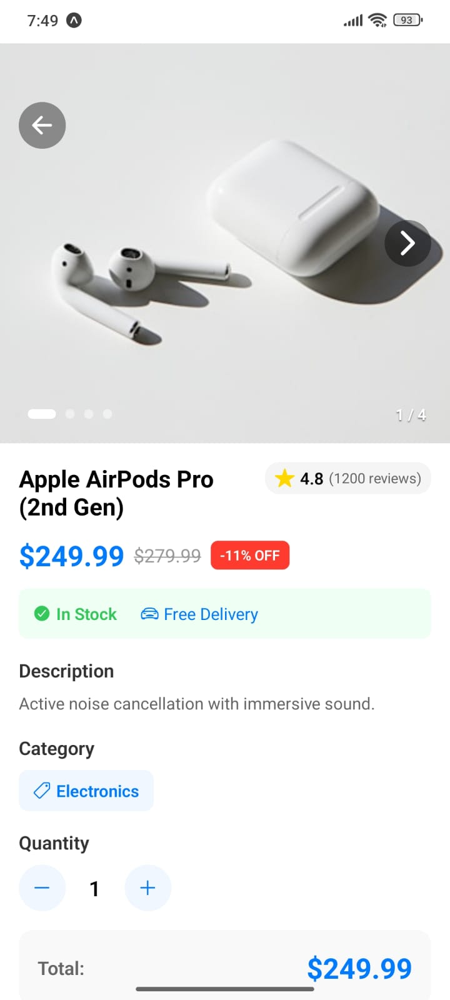
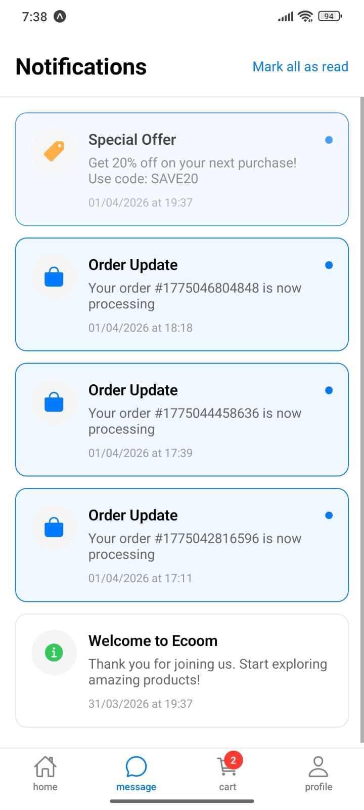
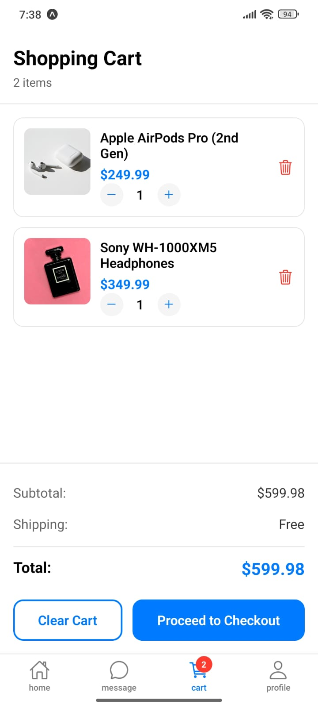

## 🛒 AlanCart

AlanCart is a modern e-commerce mobile application built with Expo (React Native).
It provides a smooth shopping experience with intuitive navigation, real-time messaging, and a clean UI.

# 📸 App Screens

🔹 Home | 💬 Messages | 🛒 Cart | 📦 ProdutDetails

  
  
  
  
  
  

  <b>Home Page</b>&nbsp;&nbsp;&nbsp;&nbsp;
  <b>Details Page</b>&nbsp;&nbsp;&nbsp;&nbsp;
  <b>Details Page</b>&nbsp;&nbsp;&nbsp;&nbsp;
  <b>Details Page</b>

---

# 🚀 Features
🏠 Home Screen – Browse featured products and categories
💬 Messaging – Chat with sellers or support
🛒 Cart System – Add, remove, and manage items
📦 Product Details – View product info, price, and images
⚡ Fast & Responsive UI powered by Expo
🧰 Tech Stack
⚛️ React Native (Expo)
🧭 Expo Router (file-based navigation)
🎨 Expo Vector Icons
📦 JavaScript / TypeScript

# 📦 Installation
1. Clone the repository
git clone https://github.com/your-username/AlanCart.git
cd AlanCart
2. Install dependencies
npm install
3. Start the app
npx expo start
📱 Run on Device
📲 Open with Expo Go
🤖 Android Emulator
🍎 iOS Simulator

# 📁 Folder Structure
AlanCart/
│── app/            # Screens (Expo Router)
│── components/     # Reusable UI components
│── assets/         # Images, icons, fonts
│── constants/      # Static values
│── utils/          # Helper functions
│── types/          # Type definitions

Contributions are welcome!
Feel free to fork this repo and submit a pull request.

# 📄 License

This project is licensed under the MIT License.

# 👨‍💻 Author

Built with ❤️ by Alan Acharya